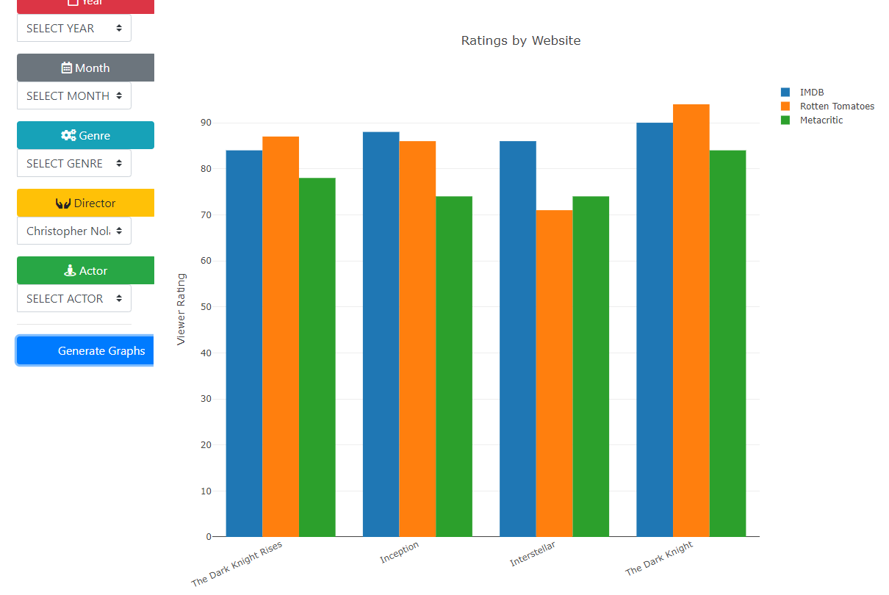
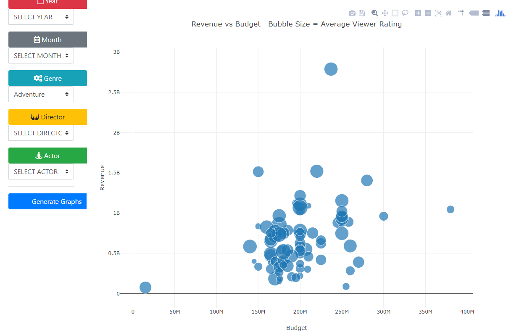
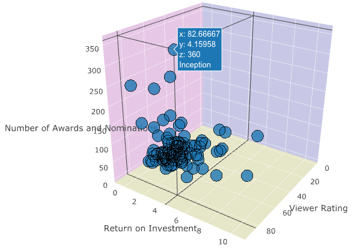

# Contributions to Movie Magic project

[Group github repo](https://github.com/vasmarm/Movie-Hawks)  
[Heroku Launch](https://obscure-bastion-66936.herokuapp.com/)\
[Data Source](https://www.kaggle.com/tmdb/tmdb-movie-metadata) 
***

### Data Wrangling

The movie data was presented to me from the database as movie objects. My task was to filter these movies based on user input and write functions to format the data for plot generation. 

First, I took the user inputed information (selectedYear, selectedActor, etc.) and filtered the movie objects by creating a list in which each individual movie includes all of the user inputed specifications. Ex: movies.year.includes(selectedYear)

In order to plot the data in the ways we wanted it was easiest to have each aspect of a movie in ordered lists so that each row of the lists coresponded to a single movie. To accomplish this empty lists were defined for each aspect and then the filtered movie list was looped through and each aspect of each movie was pushed to the lists. Now all of the data is in ordered lists, however some of the data is still in strings and dictionaries and we need single values. 

The viewer rating data for each movie came as a dictionary of three ratings sources: IMDB, Rotten Tomatoes and Metacritic. I needed to separate these values to lists to represent each individually. This involved looping through the list of ratings dictionaries and pushing the individual ratings sources into their own lists. However, some of the data was incomplete and a conditional was needed. If the ratings dictionary length was less than 3 (one for each rating source) than we added 0 to the lists as a placeholder for simplicity. 

The second movie aspect that needed updating was the awards and nominations. This came as a string, take Toy Story 3 for example: "Won 2 Oscars. Another 59 wins & 91 nominations." We decided to generate a single value that represented all awards and nominations together. The function extract_awards() pulls the numbers from each movie's awards string and sums them together then pushes to a list called number_awards. So the row in number_awards that corresponds to Toy Story 3 would have the value 152. Now, all of the data is represented in lists corresponding to the movie aspect and correclty formatted for use in visualizations. 

### Visualizations

The visualizations were created using Plotly. 

-- __Ratings__ -- \
The first chart is a simple bar graph with each bar representing a rating from a different source, grouped for each movie. The x-axis contains the title of the movie, the y-axis displays the rating value .There was some simple scaling to get IMDB ratings out of 100 to match the others. 

  

***

-- __Financial__ -- \
The second visualization is a "bubble" chart used to display financial information for the selected movies. The chart is essentially a scatter plot depicting Return on Investment. On the y-axis is Revenue, x-axis has Budget and the points or "bubbles" sizes correspond to the average of the viewer ratings from all three sources. Additionally, a mouse hover can be used to see the exact value for a bubble. 

-

  

***

-- __Success Factors__ -- \
The most interesting visualization is a 3d scatter plot that combines all three factors of success. Each axis contains a factor: ROI, Viewer Rating and Awards & Nomations. So the most successful movies would be in the highest closest corner-- the highest values for all three factors. With a click and drag the graph can be rotated, and again hover shows exact values for each factor. 

  

